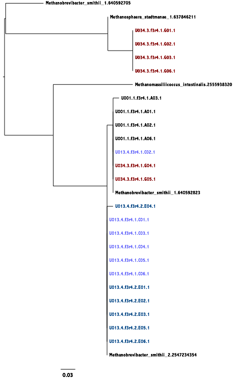

---
title: Methanogen diversity of the human gut
author: Byron J. Smith
...
<!-- Top Matter {{{-->

# Introduction #
Analysis of sequence diversity of enzymes in various hydrogenotrophic
pathways in the human gut.

While it is thought that competition for hydrogen plays a large role in
determining the prevalence of methanogens in the human gut, it is difficult
to measure the selective pressures acting on hydrogenotrophic taxa.
Here I propose to use sequence data to detect signals of selection.

Sequence based analysis of the composition of the mcrA gene population.

## Requirements and Environment ##
### Applications ###
-  [Python](http://www.python.org/) (3.4+)
-  GNU Make
-  BASH
-  phred
-  Muscle
-  FastTree
-  HMMER

<!-- /Top Matter }}}-->

# Notebook #
## Public Sequence Analysis ##
Publicly available mcrA sequences were analyzed.

### _mcrA_ Sequences Retrieval ###
(date:2015-04-06)

Genomes were selected for two sets of methanogens on IMG.
First, a "Find Functions" search for 2.8.4.1 was carried out, yielding 115
genomes with _mcrA_.
These were added to the genome cart.
Then, a search on these genomes for "2.8.4.1" yielded 431 genes, including the
alpha, beta, and gamma subunits of methyl-coenzyme M reductase.
A subsequent narrowing by entries which had "alpha subunit" in "Gene Product
Name" field, yielded 143 sequences.
As indicated by the number of genes relative to the number of genomes, a number
of genomes have two copies of the gene.
These 143 sequences were downloaded in FASTA format as
`raw/mcra.methanogens.fn`
(Actually, they were copied from the output page with spaces in between FASTA
formatted entries and these spaces were removed with `sed '/^$/d'`.)

From these 115 genomes, a search on pfam domain pfam08423 yielded 227 genes,
for both RadA and RadB.
I believe that _radA_ is the archael homologue to _recA_.
Narrowing by entries to those with two domains,
"HHH\_5(pfam14520), Rad51(pfam08423)", in the "Domains" field, yielded 113
genes.
These 113 _radA_ sequences with both domains were downloaded as a FASTA file,
`raw/rada.methanogens.fn`.

From these 113 _radA_ sequences, the 20 Gene IDs from genomes named
"Methanobrevibacter smithii TS\*" (where "\*" was replaced with a two or three
digit number followed by a letter) were collected.
These genomes correspond with the 20 genomes described in Hansen et al. 2011
of isolates collected from human feces.
Similarly, the 21 _mcrA_ sequences from these 20 genomes were also collected.

### _mcrA_ Analysis ###
(date:2015-04-07)

Nucleotide a protein alignments were made for these sequences by translating to
amino-acids, aligning these with `muscle`, and then "backaligning" the
nucleotide sequence to match the protein alignment.
While this may have _some_ shortcomings relative to a true codon alignment,
I can't imagine they are more than minimal.
Trees were then constructed for both nucleotide and protein alignments using
`fasttree`.
The resulting branch lengths could then be output, although it is worth
mentioning that branch lengths are suspect with this FastTree.
([See here.](http://www.microbesonline.org/fasttree/#BranchLen))

The _radA_ trees have one long, suspicious branch, and the two protein
sequences at its tip not blast particularly close to any other _radA_.


I have removed these sequences from analysis, but the _radA_ protein to nucleotide
branch length ratio is still about the same as the _mcrA_ ratio for all
methanogens.
In fact, it's suprising how close to the same total branch lengths for the two
trees are.

I'm interested in checking out other marker genes.
[This](https://phylosift.wordpress.com/tutorials/scripts-markers/old-pmprok-marker-gene-names/)
seems like a potentially useful list.
Marker genes aren't necessarily the best place to look, though.
I'm curious about the range of branch length ratios (BLRs) that I might find
in the methanogen or Hansen sets.

(date: 2015-06-08)

Reference sequences taken from IMG have been culled down to a single sequence
per species, per paralog.
This subset of all publicly available sequences is defined in the file
etc/refs.names.tsv along with a mapping from IMG IDs to more understandable
genus/species names.
I can get a pretty great alignment using `hmmalign` with the
[mcrA HMM from fungene](http://fungene.cme.msu.edu/hmm_detail.spr?hmm_id=16).
However, this model was made with just 26 sequences, with some deficiencies
in phylogenetic coverage.
Also, many of the sequences are fragments.
To solve this problem, I would like to use an alignment of my own.
How to make this alignment as high-quality as possible, is the question.
One option is to start with an alignment to the FunGene model, then manually or
automatically (`muscle -refine [...]`) refine that alignment and use that as
the basis for a new alignment.
Making this process reproducible is not currently possible, but my method
for manually aligning sequences is pretty simple.
I just find regions of
hmmalign output with gaps (and presumably residues which don't fit the model),
pick flanking highly conserved positions, and have muscle align between these
columns.
Based on the final log-likelihood value of a phylogenetic tree produced by
FastTree, this manual refinement can have a large improvement, and is often
larger than automatic refinement.
Unfortunately, there's no record of exactly what was changed and why I decided
to make the changes that I did.
I _can_ commit my alignment to the repository, but this is a relatively
downstream file in my analysis.

(date: 2015-06-23)

I've collected 16S sequences from IMG as well, although the coverage from
these archaea is pretty poor.
From these I can create a methanogen 16S tree to compare to the mcrA tree.
This has been done in the past, apparently, finding "high consistancy" [@TODO]
which is why mcrA is used as a phylogenetic marker gene.
I would like to know if the differences between the two mcrA clades are
apparent at the 16S level.
I doubt it, because 16S really shouldn't go down below species or genus
level variation, but it's worth a shot.
After messing with naming and the like for a long time, I get this:


It's hard to pick out much from that tree, even comparing it to the a filled
out mcrA tree:


One problem is that there's not a ton of overlap between genomes which
have an annotated _mcrA_ and those with _rrs_.
It would appear that this must be due to a lack of 16S annotation in these
genomes, since I picked the genomes based on the fact that they had a
mcrA.
I could try and pick out the 16S sequences my self, by BLASTing for them on
IMG, or something like that.

## _mcrA_ Primer Design ##

### Identifying Conserved Regions ###

(date: 2015-04-08)

While _mcrA_ would be an ideal marker gene to explore methanogen diversity
in the human gut, it's possible that primer design will be difficult for this
gene.
Alternatively, I could use archael 16S sequences but these potentially
have too little variation to observe strain-level diversity.
Genomes from Hansen et al. have very little diversity in _mcrA_, _mcrB_,
_mcrG_, etc. but this could be due to the process of isolation.
If I want to say something about strain diversity in (non-)methane producing
human subjects, I will want to use culture independent approaches.
Jessica Seiber has a set of primers which will amplify a region of 450-500bp.
This is probably too big for Illumina sequencing, but would work for a clone
library.

These primers are from Luton 2002:

| Forward: `GGTGGTGTMGGATTCACACARTAYGCWACAGC`
| Reverse: `TTCATTGCRTAGTTWGGRTAGTT`

I took a stab at designing my own primers. See `ipynb/primers.ipynb`.
The first result was this figure:


Here we see that there are regions at approximately 550, 1100, 1500, and 1550
where a 15 base primer could have a degeneracy of less than 100 (ignoring
sequence variants at a position with only one representative).
An attempt to design primers at these positions was found to be very difficult.
As a potentially easier task, primers were designed for the two
branches separated by the the deepest split in
the phylogenetic tree with 82 and 61 taxa represented, respectively.


This was done by hand with an attempt to keep degeneracy below 100, primer
lengths of ~20 bases, and ignoring sequence variants at a position with fewer
than 5 representatives.
The result were the following sequences at primer locations
(on the coding strand, so the reverse primer has to be reverse complemented):

Split A (82 taxa)
| 561 Forward: `CARGARCAYATGGTDGAR`
| 1592 Reverse: `CCWAACTAYCCWAACTAYGCHATGAAYGT`

Split B (61 taxa)
| 372 Forward: `GAYGAYCTBCACTWYGTSAACAA`
| 558 Forward: `GTBCAGGARMWSATGG`  <- Probably too short
| 1583 Reverse: `GGHSCVAACTAYCCSAACTAYGC`

I also spent some time automating the primer design process myself, and
had Tom S. recommend the software, "CODEHOP".

(date: 2015-04-10)

Potential primers can be analyzed with
[OligoAnalyzer 3.1 from IDT](https://www.idtdna.com/calc/analyzer).
Other resources can be found
[here](http://bitesizebio.com/18992/a-primer-for-designing-degenerate-primers/),
and [here](http://www.lifetechnologies.com/us/en/home/products-and-services/product-types/primers-oligos-nucleotides/invitrogen-custom-dna-oligos/primer-design-tools.html).

Methanogenesis is defined for KEGG Module M00567.

(date: 2015-05-23)

I want to make a system to automate the design of primers.
Primers should be judged on two criteria and filtered by 3 others.
Primers should have low degeneracy, but reach a large amount of the mcrA
diversity on the tree.
Degeneracy is measured as the total number of unique sequences in a degenerate
mix.
Diversity is measured as the total branch length of the tree hit by the
primers.
It would be nice to include imperfect matches, but weight the results by the
quality of the match.

(date: 2015-06-16)

I've gone ahead and actually designed some primers (largely by hand) against
the full diversity of mcrA.
While I _could_ exclude some portions of the tree, the inclusion of
_Methanomasilliicoccus_ already gives us a ton of sequence diversity, so I'll
start with the full tree.

The process of designing these primers started with identifying regions of
the gene which were highly conserved.


This figure is based on `seq/mcra-refs.afa`.
Areas of low entropy along the gene are highlighted.
The four regions of perfect (or mostly perfect) sequence conservation are
(0-indexed):

1. \[360, 369)
2. \[442, 448)
3. \[493, 500)
   ^[includes two positions with multiple AAs, although entropy is low.]
4. \[520, 531)


### Optimizing Primers and Amplicons ###

I will call each of these portions of the MSA with particularly low entropy
a "motif".
I _believe_ the first and last motif correspond to the forward and reverse
Luton primers [@Luton2002] but I may be mistaken. (TODO).
I'd like a few different things from a prospective amplicon: short enough
for paired ends to fully overlap (around 200bp) to increase base-calling
accuracy, but still with enough internal entropy to identify strain level
variation.
Alternatively, optimal length for qPCR (the shorter the better, to a point), in
which case sequence entropy doesn't matter.

The amplicon that would be formed between the first and second motif
(which I'll call 'amp1,2') would be ~90 amino acid residues, i.e. 270bp.
Too long for sequencing, maybe, but better for qPCR.
Amp2,3 would be ~180bp (perfect for Illumina); entropy is lower, however.
Amp1,3 is clearly too long.
Amp2,4 is almost exactly the same size as amp1,2 (too long).
Amp3,4 is _short_ at 120bp, and has lower entropy, but might be great for qPCR.

The usability of each motif for primers is influenced by the degeneracy of
the genetic code for each amino acid.  Here I define degeneracy as the
number of 3-base sequences needed to exhaustively cover all possible codons.
For instance, `Q` (Glutamine) has the degenerate codon `caR`
(`R` is the
[IUPACAmbiguousDNA](http://www.boekhoff.info/?pid=data&dat=fasta-codes)
letter for  stands for "purine": `A` or `G`) and has a degeneracy of 2.
Both `M` (Met/Methionine) and `W` (Trp/Tryptophan) have just one codon each.
On the opposite end of the spectrum, Serine (`S`) has `TCT`, `TCC`, `TCA`,
`TCG`, `AGT`, and `AGC`, and it's ambiguous codon can be written `WSN`:
a degeneracy of 16.

Observe:
```
Motif 1:  Y  M  S  G  G  V  G  F  T
          2  1  16 4  4  4  4  2  4

Motif 2:  F  G  G  S  Q  R
          2  4  4  16 2  8

Motif 3:  D  L  Q  D  Q  C  G
          2  8  2  2  2  2  4

Motif 4:  N  Y  P  N  Y  A  M  N  V  G  H
          2  2  4  2  2  4  1  2  4  4  2
```

A codon placed at the 3' end of the primer can be truncated to only its
first and second positions, meaning that the more degenerate 3rd position
can be ignored.
Although less useful, the first position of a codon at the 5' end can also be
truncated.

Notice the super high degeneracy of the `S` and `R` codons in motif 2.
Combined with the moderately high degeneracy of `G`, this motif has three
4-mers: `FGGS` (degeneracy: 512, excluding the 3' wobble position on the last
codon), `GGSQ` (dgn: 512), and `GSQR` (dgn: 1024).
Therefore, despite high amino acid conservation, there won't be any good
primers to be found in this motif.
The reverse direction is not much different.
I'll ignore motif #2 from this point forward.

Here I define an AA K-mer's degeneracy as the degeneracy of the nucleotide
oligomers needed to match all possible codons, truncating the final, 3'
nucleotide if "forward" or the first 5' nucleotide if "reverse".
Some of the best 4-mers are in the following table, which is not exhaustive.

| motif | direction | 4-mer         | degeneracy |
| ----- | --------- | ------------- | ---------- |
| 1     | foward       | **YMSG** | 32         |
| 1     | foward       | VGFT          | 32         |
| 3     | foward       | DLQD \*       | 32         |
| 3     | foward       | **LQDQ** | 32         |
| 3     | foward       | QDQC &dagger; | 8          |
| 3     | foward       | DQCG &dagger; | 8          |
| 3     | reverse       | **LQDQ** | 32         |
| 3     | reverse       | QDQC &dagger; | 16         |
| 4     | reverse       | NYAM          | 16         |
| 4     | reverse       | **YAMN** | 16         |
| 4     | reverse       | AMNV          | 32         |

| \* One reference sequence has `A` instead of the first `D`.
| &dagger; One reference sequence has `A` instead of `C`.
| Sequences in **bold** were selected for primer design.


Having somewhat arbitrarily selected my "conserved amino acid motif" to form
the 11 base (12 - one 3' position) "degenerate core" of my CODEHOP primer
[@Staheli2011], I'll go on to grab the consensus nucleotide sequence for the
upstream (5') clamp region for each.

The result:

```
Name       Consensus Clamp           Degenerate Core
--------   ------------------------  ----------------
mcrA1_f_0: 5' GACCAGATCTGGCTCGGATCA  TAYATGWSNGG  3'
mcrA3_f_0: 5' CTCGGATTCTACGGTTACGACC  TNCARGAYCA  3'
mcrA3_r_0: 5' GAATGAGTTTGCTGCACCACAC  TGRTCYTGNA  3'
mcrA4_r_0: 5' GTATTCTCCCTGGTGACCGACG  TTCATNGCRTA 3'

```

[Analysis](https://www.idtdna.com/calc/analyzer)
at 0.25 uM [Oligo], 50 mM [Na+], 0 mM [Mg++], 0 mM [dNTPs]:

primer | length | degen. | min($T_m$) | mean($T_m$) | max($T_m$) | notes |
------ | ------ | ---------- | ---------- | ----------- | ---------- | ----- |
mcrA1_f_0 | 32 | 32 | 61.8 | 63.7 | 65.6 | 10 base homodimer near the 5' end |
mcrA1_f_1 | 30 | 32 | 60.7 | 62.8 | 64.9 | removed 2 bases from the 5' end |
mcrA3_f_0 | 32 | 16 | 61.5 | 63.8 | 66.2 | 8 base homodimer near the 3' end |
mcrA3_f_1 | 30 | 16 | 60.5 | 63.0 | 65.6 | 2 bases from 5' end |
mcrA3_r_0 | 32 | 16 | 61.8 | 64.1 | 66.5 | |
mcrA3_r_1 | 27 | 16 | 60.4 | 63.3 | 66.2 | 5 bases from 5' end
mcrA4_r_0 | 32 | 8  | 63.1 | 64.8 | 66.2 | |
mcrA4_r_1 | 25 | 8  | 60.2 | 62.5 | 64.5 | 7 bases from 5' end

The results are promising.
I'm able to design primers for each of the regions which may just do the trick.

Also consider adding bases like 2’-deoxyInosine (/ideoxyI/), a universal
base, which will do two things: it'll increase the stability of not-quite-matching
base-pairs anywhere along the sequence
(although, if I'm not going to add it to the 3rd codon positions everywhere,
what's the point),
and it'll increase reproducibility of my oligos, since degenerate positions
will not be some undefined composition.
A superior, but more expensive alternative is 5-Nitroindole (/i5NitInd/),
which adds more than $100 to the price of oligos, but which matches in a much
less biased manner.


#### Primer Binding Sites ####


mcrA1:

```
                          Sequence        Consensus Clamp       Degen. Core
----------------------------------        --------------------- -----------

                 PRIMER: mcrA1_f_0        GACCAGATCTGGCTCGGATCA TAYATGWSNGG

                                               *  *   * *  *  *
 Methanobrevibacter_smithii_clade1   TATACGACCAAATTTGGTTAGGTTCT TACATGTCTGGTGG

                                               *      * *  *  *
 Methanobrevibacter_smithii_clade2   TTTACGACCAAATCTGGTTAGGTTCT TACATGTCTGGTGG

                                               ** *   * *  *
         Methanosphaera_stadtmanae   TATACGACCAAGTATGGTTAGGTTCA TACATGTCTGGTGG

                                            *     * **  *  *
Methanomassiliicoccus_intestinalis   TCTTCGATCAGATTTACCTTGGATCA TACATGTCTGGTGG

                                                              *
        Methanosarcina_acetivorans   TCTACGACCAGATCTGGCTCGGATCC TACATGTCCGGTGG

                                                           *  *
         Methanoculleus_bourgensis   TCTACGACCAGATCTGGCTCGGCTCC TACATGTCCGGCGG

```

mcrA3:
```
        Sequence    Fwd Consensus Clamp    Degen. Core   Rvs Consensus Clamp
----------------    ---------------------- ----------- ---------------------

      mcrA3_f_0     CTCGGATTCTACGGTTACGACC TNCARGAYCA
      mcrA3_r_0'                           TNCARGAYCA GTGTGGTGCAGCAAACTCATTC

                    * *  *        *     **
M_smithii_clade1  GATTAGGTTTCTACGGATACGATT TACAAGATCA ATGTGGTGCAGCTAACGTATTCTC
                                                      *           *   **

                    * *                 **
M_smithii_clade2  GATTAGGATTCTACGGTTACGATT TACAAGATCA ATGTGGTGCAGCTAACGTATTCTC
                                                      *           *   **

                    * *        *         *
    M_stadtmanae  GATTAGGATTCTATGGTTACGACT TACAAGATCA ATGTGGATCATCCAACTCACTCTC
                                                      *     **  * *      *

                               *  *      *
  M_intestinalis  GTCTCGGATTCTATGGATACGACT TACAGGATCA GTGCGGTTCTGCTAACTCATTCTC
                                                         *   * *  *

                         *    *     *
   M_acetivorans  GCCTCGGCTTCTTCGGTTTCGACC TGCAGGACCA GTGTGGTGCCACAAACGTTCTGTC
                                                               **     **** *

                         *    *   *
    M_bourgensis  GTCTCGGCTTCTTCGGCTACGACC TCCAGGACCA GTGCGGGTCTGCAAACTCGCTCTC
                                                         *  ** *        **

```

mcrA4:
```
                          Sequence      Degen. Core    Rvs Consensus Clamp
----------------------------------      ----------- ----------------------

      PRIMER COMPLEMENT: mcrA4_r_0      TAYGCNATGAA CGTCGGTCACCAGGGAGAATAC

 Methanobrevibacter_smithii_clade1   AACTACGCAATGAA CGTAGGTCACCAAGGTGAATACGCTG
                                                       *        *  *

 Methanobrevibacter_smithii_clade2   AACTACGCAATGAA CGTAGGTCACCAAGGTGAATACGCTG
                                                       *        *  *

         Methanosphaera_stadtmanae   AACTACGCAATGAA CGTAGGTCACCAACCTGAATATGCAG
                                                       *        ****     *

Methanomassiliicoccus_intestinalis   AACTATGCAATGAA CGTTGGTCACCTTTGCGGTTACGCTG
                                                       *       *** * **

        Methanosarcina_acetivorans   AACTACGCAATGAA CGTCGGTCACCAGGGCGGATACGCAG
                                                                   * *

         Methanoculleus_bourgensis   AACTACGCGATGAA CGTCGGTCACCAGGGCGAGTACGCCG
                                                                   *  *

```

## Clone Library Sequence Analysis ##
(date: 2015-04-28)

A single test clone came back with sequence.
When I blast the sequence, the best hit stretches from base 17 to 485.
The matching sequence goes all the way from the Luton Forward to Luton Reverse
primers, and is therefore a full length sequence of the same clone that I
sequenced.
While there are some errors near the 3' end of my sequence (a single InDel in
the primer sequence), this means that I got back the longest length I could
have hoped.

(date: 2015-05-06)

-  Recieved sequences from core.
-  Analyzed diversity and found that 3 clades of methanogens were present in
   my clones.
-  Individuals, in general, had just one clade.
-  I even found some people with Methanomasillococcus, which is really cool.


(date: 2015-05-07)

-  Based on the cleaned up alignments, the ATA C-terminus of the consensus
   protein alignment does not match with (any of?) the reference sequences.
   This sequence appears to overhang on the 5' ends of the luton amplicons I
   pull out from my clone sequences.


(date: 2015-05-19)

Sequence `2481783.M13REV` which I have listed as a re-sequence of `U003.2.1.C03`
appears to actually be a re-sequence of `U003.2.1.C02`.
Which, if I'm not mistaken, is a good thing, since these two do not differ, at
least within the g-blocks, and yet _does_ differ from many other sequences,
e.g. `U011.3.1.B01` at two positions.

I'll correct the meta-data, but I have to correct this in my notebook.
The two mutations are non-synonymous.


Things to present at lab meeting:

1.  Two species of mcrA possessing organisms in the human gut
2.  Two clades of _smithii_.
3.  Clades segregate into individuals
4.  Some nucleotide diversity in _M. smithii_
    A.  Seems biased towards third position nucleotides
    B.  But sample size pretty low and may be erroneous
5.  Caveats
    A.  Single PCR per sample
    B.  Low sample size
         -  Subjects
         -  Clones
    C.  Sequencing error
    D.  Chimeras
    E.  Primer bias/limitation

Possible experimental design:

 -  Design primers that will work for full-overlap paired ends Illumina
 -  Two independent PCR runs for each sample
     -  Only consider sequences which appear in both runs

(date: 2015-05-12)

TODO: I need to see if the separation of M. smithii into two clades is also
visible in 16S sequence.

(date: 2015-06-16)

Now that I've collected clones from a number of subjects, I feel like there's
more that can be said.


### Comparing Results Between Amplicons ###

(date: 2015-07-01)

Working with the small sequence fragment between mcrA_F3.1 and mcrA_R4.1,
which I will denote f3r4, is difficult, because it doesn't align well to the
HMM.
Since there shouldn't be any InDels in this region, though, I can just skip
the alignment step...as long as trimming is done correctly.

Based on the fact that the primer-trimmed f3r4 amplicon from the luton
clones have lots of heterogeneity at the downstream end, I'm going to guess,
as I have in the past, that this primer overlaps with my R4.1.

This turns out to be the case.

```
R4.1:     ccctggtgaccgacgttcatNgcRta
Luton_r:                 ttcattgcRtagttWggRtagtt
```

Interesting how that turns out to overlap perfectly through the "core" region
of my CODEHOP primers.
And it looks like the luton primers _are_ what's causing the heterogeneity,
since the far 3' end of the Luton reverse primer extends 12 positions
past my 3' end.
The initial PCR amplification would have included heterogeneity in these
primers in the sequence.
I would have expected the 4th and 7th positions,
counting from the first un-trimmed position on the downstream end,
to be the only variable ones, since the Luton
primers have and W and an R in those position, respectively.
What I find, instead, is that MOST of the positions are variable,
although 4 and 7 are the most pronounced.
A/T in the 4th position and C/T in the 7th.
This matches the complements of W and R ("weak" and "purine"), that we would
expect.
Why are other positions also variable, though?
Low quality would be the obvious answer, but I'm already culling low-quality
sequences...?

(date: 2015-07-06)

I've gotten the f3r4 clones back, and now I can compare the results to the
luton amplicon.
Here is the luton tree, with the overlapping subjects highlighted:


And here are the same subjects highlighted (in similar colors) on
a f3r4 tree:



Notice that Methanosphaera is easily differentiable from _M. smithii_ clones and
the other reference species.
U034 demonstrates the same combination of _M. smithii_ and _M. stadtmanae_
found with the luton primers.
Also notice that the 'other' _M. smithii_ strain (which was only found in
U013 with the luton primers) is differentiable from
the more common strain in these subjects (e.g. U001).
For this amplicon, however, that difference between _M. smithii_ strains only
amounts to a _single_ position; it's SNP typing, really.
We get one sequence (out of twelve) from that individual of the more common
strain.

# Appendices #
## Data Sources ##
### `raw/<repository>/*.ab1` ###
Raw traces were downloaded from the UM sequencing core webserver individually.

These are binary files in the ABI format.

This file is be publicly available online at:
https://dl.dropboxusercontent.com/u/\<UID\>/\<PATH_TO_FILE_IN_PUBLIC_FOLDER\>

These files can be re-downloaded automatically based on a rule in `Makefile`.

### `raw/mcra.refs.fn` ###
All mcrA sequences were downloaded from IMG.
Sequences were obtained from IMG/ER last updated 2015-04-02.
The page footer says 'Version 4.510 Oct 2014'
Sequences were found using Find Functions -> Enzyme (KEGG) and searching
for 2.8.4.1
(methyl-coenzyme M reductase a.k.a Coenzyme-B sulfoethylthiotransferase).
115 genomes were found which had this function.
Searching these genomes for 2.8.4.1 yielded 431 genes, some of which were
subunits beta and gamma, rather than just alpha.
143 sequences for subunit beta were downloaded.

Files are FASTA formatted with labels starting with a unique (to IMG) gene
ID and followed by a full description of the sequenced organism and the name
of the gene.

This file can be re-generated from IMG by following the instructions above.

## Data Semantics ##
### [example] ###
[Explanation for column meanings.]

[Any notes regarding individual observations.]
